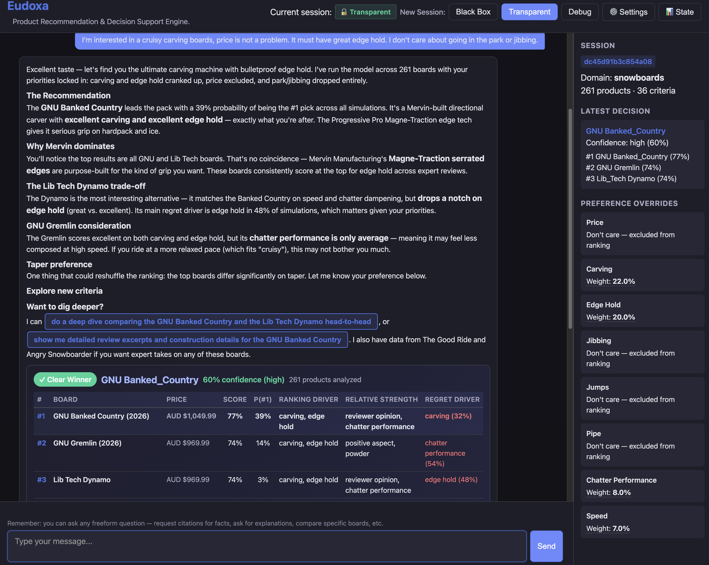
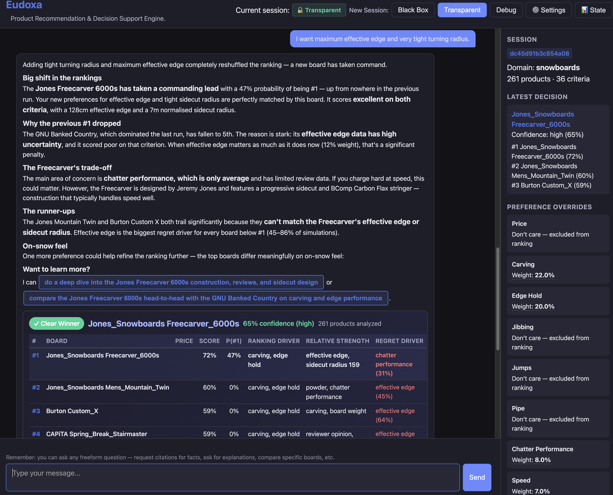
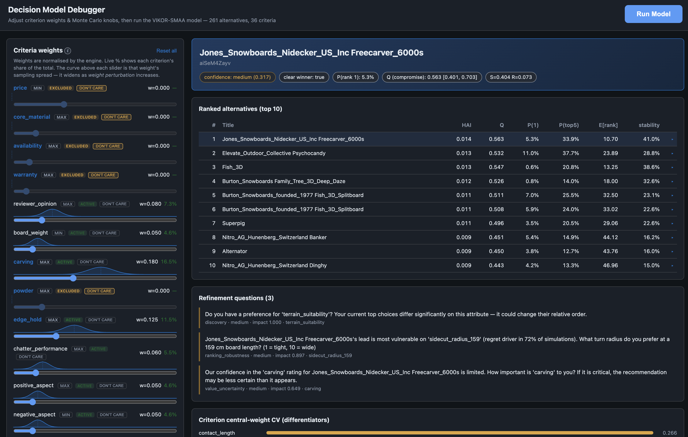
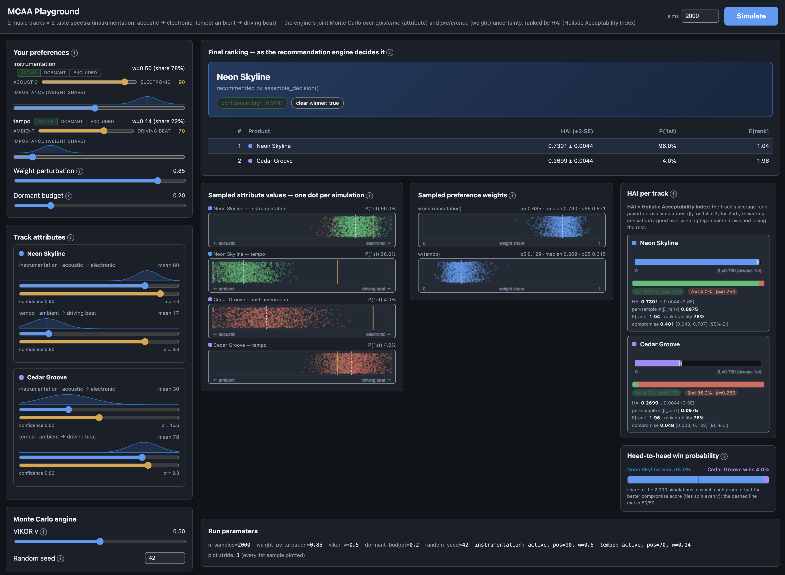

# Eudoxa

Eudoxa is an agentic product recommendation engine that uses explainable, reliable reasoning tools with grounded facts and sound epistemics.

Agent-mediated purchase decisions are here to stay. Current agentic LLM recommenders can suffer from unreliable reasoning and hallucinated facts, reducing their trustworthiness. There is little doubt that LLMs will improve with time, but until they do, we feel that LLMs and formal methods complement each other well: LLMs are flexible and naturally suited for customer interaction, and formal methods offer reliability.

Eudoxa is a deep integration between a knowledge-based system and agentic LLMs, building a more trustworthy recommendation system than one that relies solely on reasoning by an LLM.
Our thesis is that LLMs and formal methods complement each other well: LLMs are flexible and naturally suited for customer interaction, while formal methods offer reliability. Over time, we expect neural training and inference to incorporate more techniques from probabilistic modeling, formal verification, and verifier-guided learning. Eudoxa uses a standard agentic LLM approach and complements it with probabilistic and decision-theoretic tools.

We built a knowledge-based system with a decision model that represents the uncertainty in both facts and customer preferences. The model helps a customer make trade-offs between products based on attributes. Recommendations are made using compromise ranking from multi-criteria decision analysis (MCDA).  Eudoxa aims to learn more about a customer's preferences in the conversation, making the recommendation better.

The main components are:
- a decision model that runs simulations and makes product recommendations based on a database of aggregated and calibrated facts against user preferences.
- LLM agent & data broker. The agent handles conversations with an LLM and the broker is the tool interface to Eudoxa's data and decision engine.
- fact_collation is for data gathering, calibration and normalisation of facts.
- data_processing contains logic to aggregate data into a CSV database and create criteria spec and configuration files needed by the decision model.
- a server module contains a web frontend.

The repo includes example data for snowboard product recommendations to serve as a proof-of-concept. 

This is a research project and as such ongoing maintenance is expected to be intermittent.

## Whitepaper

You can read the Eudoxa whitepaper [here](eudoxa_whitepaper_2026.pdf).

## Local commands

**The code is built to use the Anthropic API.  Place your API key in secrets/anthropic_api_key, or define ANTHROPIC_API_KEY environment variable.**

Run the decision model (standalone):

```bash
./cli_decision_run.sh --n-samples 5000 --top-n 5
```

Run the local web server, then open http://localhost:8080/.

```bash
./cli_run_local_server.sh
```

Run the decision debug tool, then open http://localhost:8090/.

```bash
./documentation/cli_run_debug_app.sh
```

Run the MCAA playground, then open http://localhost:8091/

```bash
./documentation/cli_run_mc_playground.sh
```

## Example screenshots

<br>



<br><br>



<br><br>



<br><br>




## Running tests

The main test suite lives in `server/tests/` and runs with pytest from the repo
root (the debug app under `documentation/decision_debug/` has its own smoke
tests in `test_runner.py`). Optional: install uv dev deps once with
`uv sync --extra dev`.

Run the full test suite:

```bash
uv run pytest server/tests/
```

Run a single test file (e.g. the decision-model core engine tests):

```bash
uv run pytest server/tests/test_decision_model_core.py
```

Run a single test class or a single test:

```bash
uv run pytest server/tests/test_decision_model_core.py::TestPickRecommended
```

The root `pyproject.toml` is a typical Python project configuration.


## Adding a dataset

Examine the code in fact_collation, where the Anthropic websearch API is the first step, followed by scripts in data_processing.

Every CLI entry point declares a `DATASET` variable at the top of the file (currently `"snowboards"`) that selects which dataset folder to use; to point the pipeline at another dataset, edit that variable in the entry points you run. The variable parameterizes the folder only; the data files inside the dataset folders use dataset-neutral names (e.g. `product_comparison.csv`, `product_criteria_spec.json` in `data_processing/<dataset>/`, `product_comparison_normalized.csv` in `fact_collation/<dataset>/final_csv_output/`), so switching datasets requires no file renames in the scripts. The shell scripts also accept a `DATASET` environment variable, but note it does not propagate into the Python constants — each Python entry point carries its own switch.
